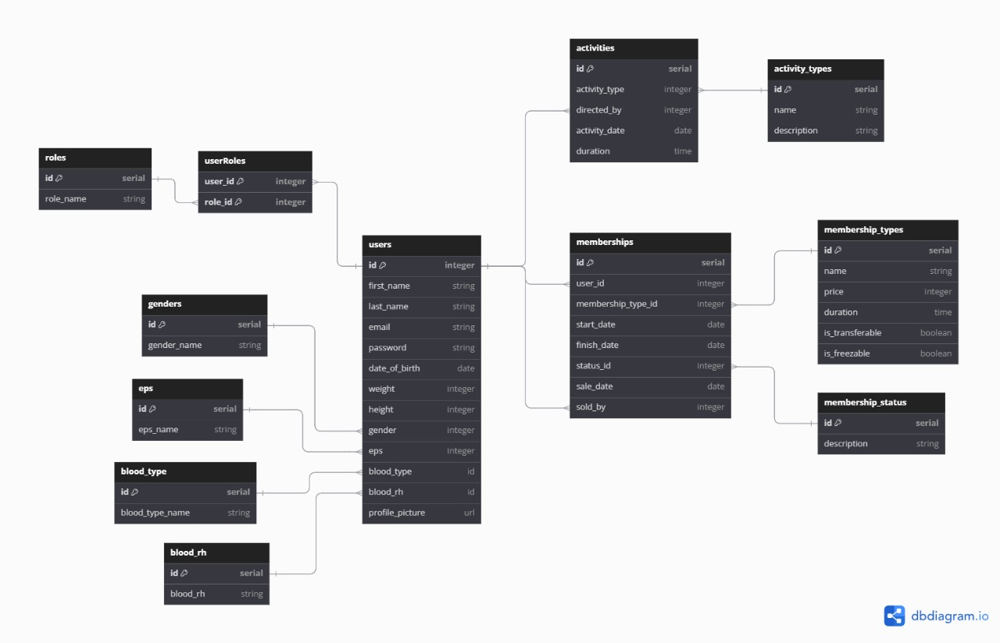

# Active Gym API 🏋️
This is the repository for the backend of Active Gym App project. This application is designed for gym and sports stablishments that desire having a centralized platform for managing all related to their business.

## Overview 👀

The Active Gym Backend is a Spring Boot application that manages gym memberships, user information, and administrative roles. This project is designed to support a gym management system with various functionalities, including user authentication, membership management, and role-based access control.

## Features 📱

- **User Management**: Create, read, update, and delete user profiles.
- **Membership Management**: Manage different membership types, including their status and duration.
- **Role-Based Access Control**: Support for different roles (Admin, Sales Advisor, Trainer) with specific permissions.
- **JWT Authentication**: Secure user authentication using JSON Web Tokens (JWT).
- **Cookies authorization**: Generate Http-Only cookies for role based access on frontend app.
- **Scheduled Tasks**: Automatically update membership statuses based on their expiration dates.
- **Some other features will be added soon!**

## Technologies Used 🛠️

- **Backend Framework**: Spring Boot
- **Database**: PostgreSQL
- **Security**: Spring Security, JWT
- **Development Tools**: Gradle

## Database model 🗂️
*Next up you can see the model followed for designing the entities for the project, note that some fields have been added and some have been edited:*

## Contact me! ✌️

Feel free to contact me if you have any doubts about my project or interested in collaborating on it:
- **📩 Email: [carlosestc0911@gmail.com](mailto:carlosestc0911@gmail.com)**
- **👤 LinkedIn: [LinkedIn] (https://www.linkedin.com/in/carloscastro0911/)**
